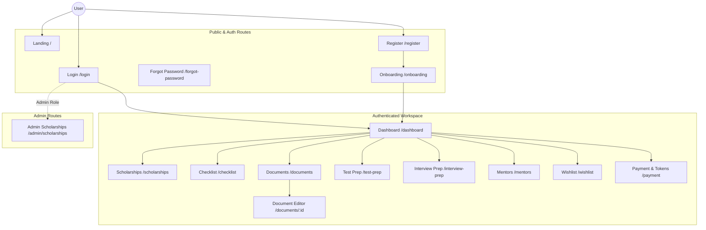

<div  align="center">

# Minerva Frontend Client

**A one-stop solution AI powered platform that helps scholarship seekers from recommendations to preparing application requirements, all in one application.**

<p>

    

</p>

[Overview](#overview) &nbsp;&bull;&nbsp; [Features](#key-features) &nbsp;&bull;&nbsp; [Demo](#live-demo) &nbsp;&bull;&nbsp; [Installation](#installation) &nbsp;&bull;&nbsp; [API Docs](#api-documentation)

</div>

<hr/>

##  Table of Contents

- [Overview](#overview)

- [The Problem](#the-problem)

- [Our Solution](#our-solution)

- [Key Features](#key-features)

- [Live Demo](#live-demo)

- [Tech Stack](#tech-stack)

- [Architecture](#architecture)

- [Installation](#installation)

- [API Documentation](#api-documentation)

- [Deployment](#deployment)

- [Team](#team)

- [Acknowledgments](#acknowledgments)

- [Contact & Support](#contact--support)

- [Project Status](#project-status)

<hr/>

##  Overview

Minerva is a comprehensive Single Page Application (SPA) designed to assist students in discovering, tracking, and successfully applying for global scholarships. Acting as the face of the Minerva ecosystem, this frontend provides an intuitive, highly interactive interface for managing complex application requirements, preparing for interviews, reviewing documents, and connecting with mentors.

<hr/>

##  The Problem

Students often use multiple websites and services to search for scholarships, review application documents, prepare for language tests, and find mentors. This creates several problems:

- Scholarship information is scattered across different platforms.
- Students don’t know which scholarships match their profiles.
- Scholarship requirements may be difficult to understand.
- Documents may not meet scholarship standards.
- Scholarship time-window may be difficult to track.
- Students have limited access to interview and test preparation.

<hr/>

##  Our Solution

Minerva replaces the chaos of scattered spreadsheets and folders with one connected workspace. We designed the frontend to seamlessly bridge the gap between tracking requirements and actually writing the applications. A user can discover a scholarship (`/scholarships`), see exactly what is needed on their dashboard (`/dashboard` and `/checklist`), and jump straight into drafting their essays with AI assistance (`/documents/:documentId`). As documents are updated, the checklist stays perfectly in sync.

<hr/>

##  Key Features

Based on the implemented views and core components, the frontend offers the following capabilities:

### Discovery & Planning

- **Scholarship Explorer**: Browse, filter, and view detailed information for scholarships globally (`/scholarships`, `/scholarships/:id`).

- **Wishlist Tracking**: Save prospective opportunities and compare options (`/wishlist`).

- **Dynamic Checklists**: Track application milestones and specific requirements seamlessly (`/checklist`).

### Preparation & Review

- **Document Management & AI Editor**: Create, upload, and refine application essays and letters of recommendation. Features a dedicated rich-text document editor (`/documents`, `/documents/:documentId`).

- **Test Preparation**: Integrated modules for practicing standardized tests (e.g., IELTS) with targeted exercises (`/test-prep`).

- **Interview Readiness**: Dedicated workspaces to simulate and prepare for application interviews (`/interview-prep`).

### Mentorship & Economics

- **Mentor Directory**: Find and connect with experienced mentors for personalized guidance (`/mentors`).

- **Token System & Payment**: Built-in wallet mechanism to manage platform tokens for booking mentors or unlocking premium reviews (`/payment`).

<hr/>

##  Live Demo

### 🔗 Access Minerva

- **Production URL**: [https://app.minerva.ac.id/](https://app.minerva.ac.id/)

<hr/>

##  Tech Stack

The application is built on a modern, high-performance web stack:

### Core Framework

- **Framework**: Vue.js 3.5 (Composition API)

- **Routing**: Vue Router 4

- **State Management**: Pinia

- **Build Tool**: Vite 8

### Styling & UI

- **CSS Framework**: Tailwind CSS v4

- **Icons**: Lucide Vue Next

- **Animations**: GSAP (GreenSock Animation Platform)

- **Typography**: Fontsource (Nunito & Nunito Sans)

### Data & API

- **API Client**: Elysia Eden (`@elysia/eden`) for end-to-end type safety

- **Validation**: TypeScript strict mode

### Utilities

- **Document Processing**: docx, jspdf

- **Product Tours**: driver.js

<hr/>

##  Architecture

The diagram below outlines the Vue router flow, primary user journeys, and component hierarchy:



<hr/>

##  Installation

Follow these steps to set up the development environment locally:

1.  **Clone the repository:**

```bash

git clone https://github.com/YangHansen/project-minerva-fe.git

cd project-minerva-fe

```

2.  **Configure Environment Variables:**

Copy the example environment file and configure it. Ensure `VITE_API_URL` points to your backend instance.

```bash

cp .env.example .env

```

3.  **Install Dependencies:**

The project utilizes Bun as its package manager.

```bash

bun install

```

4.  **Start the Development Server:**

```bash

bun run dev

```

The application will be available at `http://localhost:5173`.

<hr/>

##  API Documentation

The frontend utilizes `@elysia/eden` to consume backend types and endpoints, guaranteeing end-to-end type safety between the server and the Vue client.

Rather than relying on loosely typed `fetch` wrappers, the `src/api.ts` module exports a strongly typed `apiRequest` function and a legacy Eden `treaty` client:

- **Type Safety**: Backend Elysia instances automatically export their OpenAPI/TypeBox schemas. The Eden client consumes these, meaning breaking changes in backend models immediately trigger TypeScript errors in the frontend during development or build (`vue-tsc -b`).

- **Error Handling**: Network failures and API rejections are normalized into a consistent `ApiError` class, simplifying UI state management (loading vs. error states).

- **Authentication**: The router hooks into a global authentication check (`ensureAuthenticated()`) which transparently calls `/api/auth/me` to hydrate the user session and Pinia state before navigating to protected `/workspace` routes.

<hr/>

##  Deployment

The frontend application and global infrastructure are managed through **Cloudflare**.

- **Hosting & CI/CD:** The Vue/Vite client is deployed via Cloudflare Pages, which automatically builds and serves the static assets on every push to the main branch.
- **Infrastructure:** Cloudflare is also utilized for all DNS management and custom domain routing, ensuring fast, global content delivery for the frontend.

_(Note: The companion backend API is containerized using Docker to run the Bun environment and is hosted independently on Render.)_

<hr/>

##  Team

**Minerva** is developed by **HERMES Team** as part of our capstone project.

<table>
  <tr>
    <td align="center">
      <br/>
      <b>Bridget Beatrix Claire</b><br/>
      <a href="https://linkedin.com/in/bridget-claire">
        
      </a><br/>
    </td>
    <td align="center">
      <br/>
      <b>Hansen</b><br/>
      <a href="https://linkedin.com/in/Hansen">
        
      </a><br/>
    </td>
    <td align="center">
      <br/>
      <b>Mutya Qurratu'ayuni Mustafa</b><br/>
      <a href="https://linkedin.com/in/Mutya-Qurratuayuni-Mustafa">
        
      </a><br/>
    </td>
  </tr>
  <tr>
    <td align="center">
      <br/>
      <b>Syafira Al Atika</b><br/>
      <a href="https://linkedin.com/in/Syafira-Al-Atika">
        
      </a><br/>
    </td>
    <td align="center">
      <br/>
      <b>Tsabitah Dinniyah</b><br/>
      <a href="https://linkedin.com/in/tsabitahdinniyah">
        
      </a><br/>
    </td>
    </td>
    <td align="center">
            <br/>
      <b>Yusril Zubaydi</b><br/>
      <a href="https://linkedin.com/in/yusril-zubaydi">
        
      </a><br/>
    </td>
  </tr>
</table>

<hr/>

##  Acknowledgments

- **Sustainable Development Goals (SDG 4)** for inspiring our mission
- **OpenAI** for embedding models
- **MongoDB Atlas** for database hosting
- **All open-source contributors** whose libraries made this possible

<hr/>

##  Contact & Support

**Email**: minerva.ai@keemail.me

<hr/>

##  Project Status

**Current Version**: 1.0.0 (MVP Ready)

**Roadmap**:

- [x] **Phase 1: Core Architecture & Data** (Authentication, Normalized Scholarship Database)
- [x] **Phase 2: Intelligent Discovery** (AI Recommendations, Search & Filtering)
- [x] **Phase 3: Unified Workspace** (Checklist Tracker & Document Management Bridge)
- [x] **Phase 4: Preparation & Mentorship** (AI CV/Essay Reviews, IELTS Simulations, Mentor Booking)
- [x] **Phase 5: MVP Deployment** (Cloudflare & Render Infrastructure)
- [ ] **Phase 6: Advanced Ecosystem** (Real Payment Processing, Direct University Portal Integrations)
- [ ] **Phase 7: Global Scaling** (Advanced AI Model Training, Full Multilingual Support)
